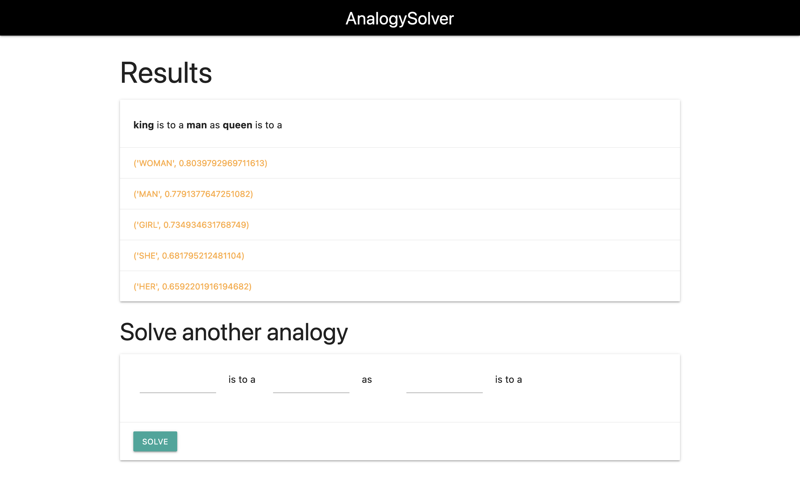
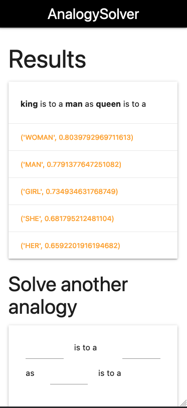
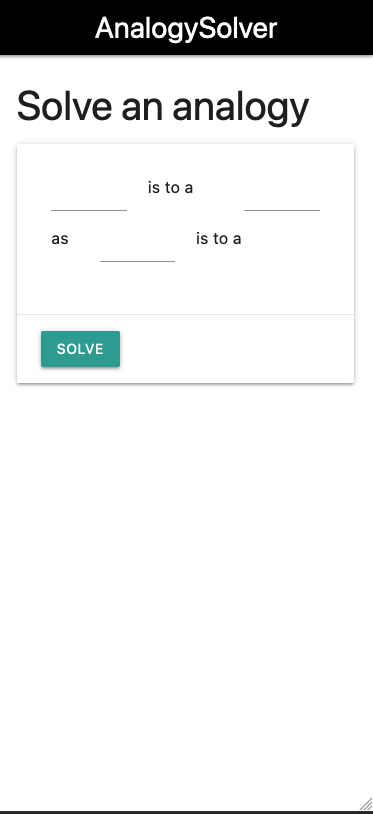

# AnalogySolver


Analogy solver provides a web app to solve analogies used NaturalLP(word embedings) to solve analogies.

Here we are using a glove pretrained model you can find more information anout it [here](https://nlp.stanford.edu/projects/glove/)

 


# DataSet

We are using the Glove (glove.6B.100d) dataset, you can download it from [here](https://nlp.stanford.edu/projects/glove/)

# Setup

1. Download glove
Download glove.6B.zip from [https://nlp.stanford.edu/projects/glove/](https://nlp.stanford.edu/projects/glove/) unzip it.
Move the 'glove.6B.100d' file to the project folder.

2. Create a virtualenv and activate it 
```
python3 -m virtualenv env
```
```
source env/bin/activate
```

3. Install the dependencies
```
pip install -r requirements.txt
```

4. Run the project
```
python manage.py runserver
```

5. Go to `localhost:8000` and have fun!

